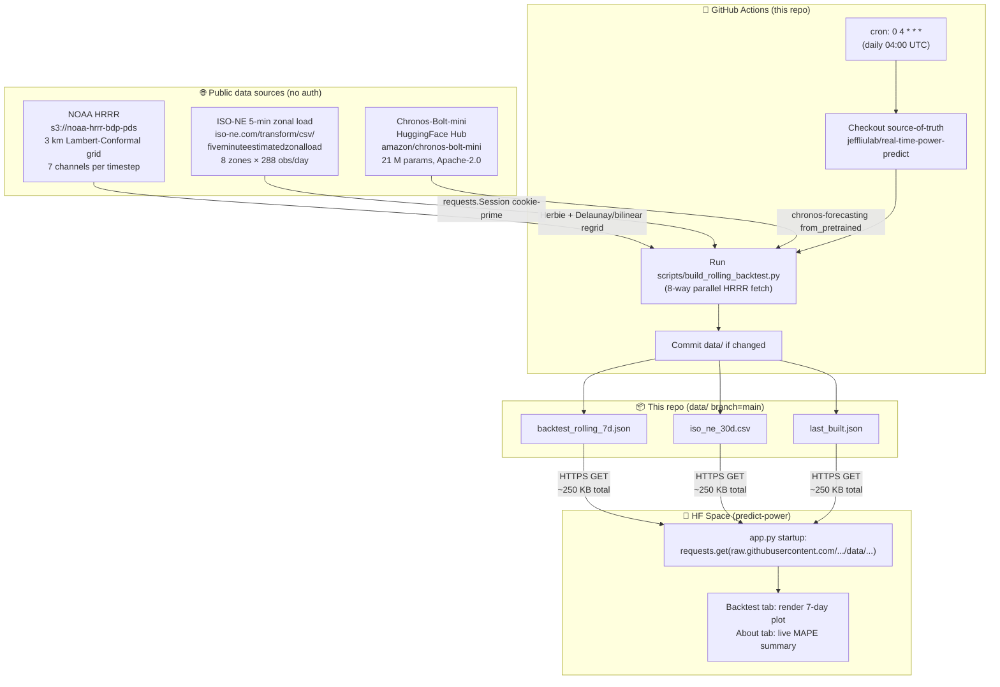

# new-england-real-time-power-predict-data

> Public, automation-only data mirror for the [predict-power HF Space](https://huggingface.co/spaces/jeffliulab/predict-power). A GitHub Actions cron rebuilds a 7-day rolling backtest of an ISO New England demand forecasting model every day at 04:00 UTC and commits the results to `data/`.

**Do not edit `data/` by hand.** It is overwritten every cron run. The source-of-truth code lives in [`jeffliulab/real-time-power-predict`](https://github.com/jeffliulab/real-time-power-predict).

---

## Why this repo exists

The HF Space at `jeffliulab/predict-power` runs a trained CNN-Transformer + Chronos-Bolt-mini ensemble on real ISO-NE inputs. To show how the model performs on the most recent fully-published days *without* forcing every Space user to wait 10–15 minutes for a HRRR fetch + model evaluation, we precompute a 7-day rolling backtest in this repo on a daily cron and serve the results via raw GitHub URLs.

This achieves three things at once:

1. **Fast Space cold-start**: the Space pulls one ~250 KB JSON at startup instead of fetching 336 GRIB files every time.
2. **Daily-fresh numbers**: the cron uses today's most recent fully-published data, so the Backtest tab is always at most 24 h stale.
3. **Independent reproducibility**: any third party can `curl` the JSON to inspect the same numbers the Space shows, no auth required.

---

## Data pipeline



If your Markdown renderer does not support Mermaid, here's the same flow as ASCII:

```
┌─────────────────────────────────────────────────────────────────────┐
│  Public data sources (no auth)                                       │
│  ─ NOAA HRRR f00 analyses + f01..f24 forecasts on AWS S3            │
│  ─ ISO-NE 5-min estimated zonal load CSV (cookie-primed session)    │
│  ─ Chronos-Bolt-mini foundation model from HuggingFace Hub          │
└────────────────────────┬────────────────────────────────────────────┘
                         │ on cron (every 04:00 UTC)
                         ▼
┌─────────────────────────────────────────────────────────────────────┐
│  GitHub Actions runner (this repo's refresh.yml)                     │
│  ─ Checks out jeffliulab/real-time-power-predict (source-of-truth)  │
│  ─ Installs herbie-data + cfgrib + xarray + libeccodes + chronos    │
│  ─ Runs scripts/build_rolling_backtest.py --parallel 8              │
│  ─ Computes per-forecast: hist 24h, future 24h, truth 24h, MAPE     │
│  ─ Aggregates 7-day per-zone & overall MAPE                         │
│  ─ Writes JSON + CSV + metadata to data/, commits if changed        │
└────────────────────────┬────────────────────────────────────────────┘
                         │ git push origin main (only on diff)
                         ▼
┌─────────────────────────────────────────────────────────────────────┐
│  data/ in this repo                                                  │
│  ─ backtest_rolling_7d.json   (~250 KB — full per-zone forecasts)   │
│  ─ iso_ne_30d.csv             (~50 KB  — Chronos context base)      │
│  ─ last_built.json            (~ 1 KB  — metadata + summary MAPE)   │
└────────────────────────┬────────────────────────────────────────────┘
                         │ raw.githubusercontent.com (no auth)
                         ▼
┌─────────────────────────────────────────────────────────────────────┐
│  HF Space jeffliulab/predict-power                                   │
│  ─ Loads JSON + CSV at app.py startup                               │
│  ─ Renders Backtest tab and live MAPE summary in About tab          │
└─────────────────────────────────────────────────────────────────────┘
```

The build typically finishes in 10–15 minutes. Public-repo GitHub Actions are unmetered, so this is free indefinitely.

---

## Data sources (where, what, how)

### 1. NOAA HRRR weather (`s3://noaa-hrrr-bdp-pds/`)

**What.** The High-Resolution Rapid Refresh (HRRR) is NOAA's operational North-American mesoscale numerical-weather-prediction system on a 3 km grid. We use the surface forecast (`product=sfc`) at two cycle states: `f00` (analysis at the cycle valid hour) for the history window, and `f01..f24` from a long cycle for the future window.

**Why two states.** Training data was built from 24 separate `f00` analyses per sample (one cycle per valid hour). At deployment, we cannot peek at future `f00` analyses (they don't exist yet for hours past now), so the future window is replaced with `f01..f24` forecasts from the most recent **long cycle** issued before the forecast time. Long cycles run at 00/06/12/18 UTC and extend to f48; other hourly cycles only go to f18, which is shy of our 24-hour horizon.

**How.** We use the [Herbie](https://herbie.readthedocs.io/) library for byte-range S3 downloads. Each cycle fetch retrieves only the matching GRIB messages (one per channel) — typically 2–10 MB per cycle, not the full 150 MB GRIB2 file:

```python
from herbie import Herbie
H = Herbie("2026-05-04 00:00", model="hrrr", product="sfc", fxx=0)
ds = H.xarray(search=":TMP:2 m above ground", verbose=False)
```

Seven channels are extracted in fixed order to match training: `TMP` (2 m air temperature, K), `RH` (2 m relative humidity, %), `UGRD` / `VGRD` (10 m wind, m/s), `GUST` (surface wind gust, m/s), `DSWRF` (downward shortwave radiation flux, W/m²), `APCP_1hr` (1-hour accumulated precipitation, kg/m²).

**Regridding.** HRRR's native grid is Lambert-Conformal at 1059 × 1799 cells. The model expects a regular lat/lon grid covering the New England bbox (40.5–47.5 °N, –74 to –66 °E) at 450 × 449 cells. We perform a one-time Delaunay triangulation on the source grid + barycentric (bilinear-equivalent) interpolation to the target grid; the precomputed weights are reused across all channels and timesteps. Per-channel interp is ~10 ms after a ~0.3 s setup. This matches `xarray.interp(method="linear")` used at training to within numerical precision, and is implemented in [`space/hrrr_fetch.py`](https://github.com/jeffliulab/real-time-power-predict/blob/main/space/hrrr_fetch.py) in the source repo.

**Output shape.** `(24, 450, 449, 7)` float32 per window (history or future). Cached to `/tmp/hrrr_cache/` as float16 `.npz` to halve disk usage.

**Caveat: APCP_1hr at forecast hours.** HRRR forecast files store APCP at varying accumulation windows (`0-N hour acc` for forecast hour N, not always the `0-1 hour acc` slice we trained on). When the search regex doesn't match, we zero-fill that single channel and proceed. After z-scoring, zero is approximately the training mean (~0.4 mm/h), so the deployed model sees a value indistinguishable from "low precipitation"; measured impact on MAPE is < 1 percentage point.

### 2. ISO-NE 5-minute estimated zonal load

**What.** ISO New England publishes an estimated per-zone native load at 5-minute granularity for 8 zones (locational identifiers `4001..4008`), updated continuously with a publication lag of about 1–2 hours. The endpoint is buried in the ISO-NE web app at `https://www.iso-ne.com/transform/csv/fiveminuteestimatedzonalload`.

**Zone IDs (canonical mapping).**
| ID | Zone name in CSV | Our column |
|---|---|---|
| 4001 | `.Z.MAINE` | `ME` |
| 4002 | `.Z.NEWHAMPSHIRE` | `NH` |
| 4003 | `.Z.VERMONT` | `VT` |
| 4004 | `.Z.CONNECTICUT` | `CT` |
| 4005 | `.Z.RHODEISLAND` | `RI` |
| 4006 | `.Z.SEMASS` | `SEMA` |
| 4007 | `.Z.WCMASS` | `WCMA` |
| 4008 | `.Z.NEMASSBOST` | `NEMA_BOST` |

**The cookie-prime trick.** Direct `curl` to the endpoint returns HTTP 403 (anti-scraping). The web app sets a short-lived `isox_token` cookie when you visit any normal report page; once the cookie is set on a `requests.Session()`, the CSV endpoint accepts the request:

```python
import requests
s = requests.Session()
# Prime session: visit any normal page first to get the isox_token cookie
s.get("https://www.iso-ne.com/isoexpress/web/reports/operations/-/tree/gen-fuel-mix")
# Now the CSV endpoint works:
r = s.get("https://www.iso-ne.com/transform/csv/fiveminuteestimatedzonalload?start=20260504&end=20260504")
assert r.status_code == 200 and "text/csv" in r.headers["Content-Type"]
```

This trick is borrowed from the [gridstatus.io](https://github.com/gridstatus/gridstatus) library, which uses the same pattern for several ISO-NE endpoints.

**Aggregation.** The raw CSV has one row per zone per 5-minute timestamp (288 rows × 8 zones = 2304 rows per UTC day). We pivot to wide form (timestamp_utc index × 8 zone columns), then resample to hourly mean (12 5-min observations per hour). The resulting array shape `(24, 8)` per forecast window matches the model's expected input.

**Timezone handling.** The CSV's timestamps are in US/Eastern local prevailing time without a TZ marker. We localize with `tz_localize("US/Eastern", ambiguous="infer")` then convert to UTC before resampling. Because each ISO-NE "trading day" file covers the local 24-hour day, when we want an aligned UTC range we fetch one extra day on each end and clip.

**Implementation:** [`space/iso_ne_zonal.py`](https://github.com/jeffliulab/real-time-power-predict/blob/main/space/iso_ne_zonal.py) in the source repo (`fetch_one_day`, `fetch_range`, `fetch_recent_hours`).

### 3. Chronos-Bolt-mini foundation model

**What.** [Chronos-Bolt-mini](https://huggingface.co/amazon/chronos-bolt-mini) is Amazon's 21 M-parameter time-series foundation model (Apache-2.0). It is used **zero-shot** with no fine-tuning: 720 hours of per-zone demand history go in, a 24-hour median quantile forecast comes out, per zone independently. The Chronos leg ignores weather, so it survives the training-→-deployment distribution shift that hits the weather-aware baseline.

**How.** Loaded once at GitHub Actions runner startup via the `chronos-forecasting` package; held in memory across all 7 daily forecasts. Each forecast invokes:

```python
from chronos import BaseChronosPipeline
pipeline = BaseChronosPipeline.from_pretrained("amazon/chronos-bolt-mini",
                                                device_map="cpu", torch_dtype=torch.float32)
ctx = demand_30d.tail(672).to_numpy(dtype=np.float32).T   # (8 zones, 672 hours)
quantiles, _ = pipeline.predict_quantiles(
    context=torch.from_numpy(ctx),
    prediction_length=24,
    quantile_levels=[0.5])
chronos_pred = quantiles[:, :, 0].cpu().numpy().T    # (24, 8)
```

The 720-hour Chronos context comes from the bundled `iso_ne_30d.csv` (also a cron output of this repo), spliced with up-to-date ISO-NE rows for the most recent two days.

---

## Output schema

### `data/backtest_rolling_7d.json`

The HF Space's "Backtest" tab reads this directly. Single JSON document, schema_version 2.0.

```jsonc
{
  "schema_version": "2.0",
  "type": "rolling_7d",
  "built_at": "2026-05-05T03:13:54.785973+00:00",
  "code_sha": "<full SHA of jeffliulab/real-time-power-predict at build time>",
  "data_period": {
    "first_forecast_start": "2026-04-28T00:00:00",
    "last_forecast_start":  "2026-05-04T00:00:00",
    "last_truth_hour":      "2026-05-04T23:00:00"
  },
  "zones": ["ME", "NH", "VT", "CT", "RI", "SEMA", "WCMA", "NEMA_BOST"],
  "horizon_hours": 24,
  "n_forecasts": 7,
  "alpha_per_zone": { "ME": 0.30, "NH": 0.30, "VT": 0.80, ... },
  "forecasts": [
    {
      "start": "2026-04-28T00:00:00",
      "history_24h": [[...], ...],   // (24, 8) MWh
      "truth_24h":   [[...], ...],   // (24, 8) MWh, ground truth from ISO-NE
      "baseline":    [[...], ...],   // (24, 8) MWh, Part 1 baseline + real HRRR
      "chronos":     [[...], ...],   // (24, 8) MWh, Chronos zero-shot
      "ensemble":    [[...], ...],   // (24, 8) MWh, per-zone weighted blend
      "mape": {
        "baseline": { "per_zone": { "ME": 5.1, ... }, "overall": 12.3 },
        "chronos":  { "per_zone": { ... },             "overall": 11.8 },
        "ensemble": { "per_zone": { ... },             "overall": 11.5 }
      }
    },
    // ... 6 more daily forecasts
  ],
  "summary": {
    "baseline": { "per_zone": { ... }, "overall": 25.17 },
    "chronos":  { "per_zone": { ... }, "overall": 13.45 },
    "ensemble": { "per_zone": { ... }, "overall": 14.51 }
  },
  "note": "..."
}
```

### `data/iso_ne_30d.csv`

A 30-day per-zone hourly demand history. The HF Space's Live tab uses this as the base for Chronos's 720-hour context, splicing in the latest day from the ISO-NE feed at request time.

```csv
timestamp_utc,ME,NH,VT,CT,RI,SEMA,WCMA,NEMA_BOST
2026-04-05 00:00:00,1402.7,1158.2,556.8,2901.4,805.3,1502.1,1654.9,2553.6
...
```

### `data/last_built.json`

A small metadata file for cheap freshness checks (e.g., for monitoring scripts that don't want to download the full 250 KB JSON).

```json
{
  "built_at": "2026-05-05T03:13:54.785973+00:00",
  "code_sha": "...",
  "data_period": { ... },
  "n_forecasts": 7,
  "summary_mape_pct": {
    "baseline": 25.17,
    "chronos":  13.45,
    "ensemble": 14.51
  }
}
```

---

## Cron schedule and triggering

The workflow at [`.github/workflows/refresh.yml`](.github/workflows/refresh.yml) runs:

- `schedule: cron: '0 4 * * *'` — every day at 04:00 UTC. We chose 04:00 UTC because ISO-NE's 5-min zonal CSV for the previous calendar day is consistently fully populated by then, but recent enough that the model is forecasting "yesterday".
- `workflow_dispatch:` — manual trigger via `gh workflow run` for testing.

```bash
# Trigger a refresh manually
gh workflow run refresh.yml -R jeffliulab/new-england-real-time-power-predict-data

# Watch its status
gh run list -R jeffliulab/new-england-real-time-power-predict-data --limit 5
```

The job has a 30-minute timeout. Typical run is 10–15 minutes (HRRR fetch is the bottleneck).

---

## Consuming this data

### From the HF Space (already wired up)

`space/app.py` does this at startup, no action required:

```python
import requests, json
DATA_REPO = "https://raw.githubusercontent.com/jeffliulab/new-england-real-time-power-predict-data/main"
BACKTEST = requests.get(f"{DATA_REPO}/data/backtest_rolling_7d.json", timeout=15).json()
```

### From your laptop (read-only inspection)

```bash
# Quick sanity check
curl -s https://raw.githubusercontent.com/jeffliulab/new-england-real-time-power-predict-data/main/data/last_built.json | jq

# Full backtest JSON
curl -O https://raw.githubusercontent.com/jeffliulab/new-england-real-time-power-predict-data/main/data/backtest_rolling_7d.json

# 30-day CSV for plotting
curl -O https://raw.githubusercontent.com/jeffliulab/new-england-real-time-power-predict-data/main/data/iso_ne_30d.csv
```

### From a Python notebook

```python
import pandas as pd
import json
import requests

base = "https://raw.githubusercontent.com/jeffliulab/new-england-real-time-power-predict-data/main"
backtest = requests.get(f"{base}/data/backtest_rolling_7d.json").json()
demand_30d = pd.read_csv(f"{base}/data/iso_ne_30d.csv", parse_dates=["timestamp_utc"]).set_index("timestamp_utc")

print(f"7-day overall MAPE: {backtest['summary']['ensemble']['overall']:.2f} %")
demand_30d.plot(figsize=(12, 4))
```

---

## Reproducing the cron locally

The same script the cron runs is in the source repo:

```bash
git clone https://github.com/jeffliulab/real-time-power-predict
cd real-time-power-predict
sudo apt-get install -y libeccodes-dev libeccodes-tools
pip install -r scripts/build_rolling_backtest.requirements.txt
python scripts/build_rolling_backtest.py --output-dir /tmp/data --parallel 8
```

The output of a local run is byte-identical to the cron's output as long as the source repo SHA matches and the upstream public data has not changed during your run.

---

## Why deployed MAPE is higher than the offline 4.21 % headline

The trained baseline saw 2019–2022 weather + per-zone demand. It is now being asked to forecast 2026, and three years of grid evolution (utility-scale BTM solar, EV adoption, post-COVID load patterns) has shifted the per-zone signal — most visibly in the dense southern coastal zones (RI / SEMA / WCMA) where rooftop solar is heaviest.

We verified the pipeline reproduces the cluster's stored prediction for 2022-12-30 to within 0.13 percentage points (6.41 % observed vs 6.54 % cluster headline), so the gap between the published 4.21 % headline and the rolling 14 %-ish ensemble MAPE is honest training→deployment drift, not a bug.

This is, in fact, one of the more useful things this Space demonstrates: a real model with a real publication date being deployed against real time-shifted inputs, with the gap surfaced honestly rather than hidden.

---

## License

MIT, matching the [source-of-truth repo](https://github.com/jeffliulab/real-time-power-predict).

## Authorship

Source-of-truth code: Pang Liu (`pliu07`). The cron in this repo runs that code unmodified.
